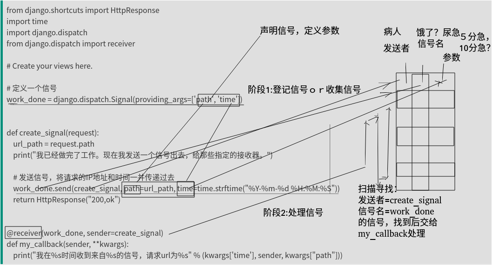

# django进阶01信号
看起来简单，用起来简单。理解起来则未必容易。上学那会这一块就没整明白，这两天又查了下资料，算是基本弄懂了。

为何难以理解？个人感觉起名占了很大一部分，如果signal命名为“观察者”，“监控者”，“盯梢者"，就容易理解多了。其本质就是一种典型观察者模式。命名为信号，第一感觉是”信号量“类似的东西。


## 定义信号

```
import django.dispatch
pizza_done = django.dispatch.Signal(providing_args=["toppings", "size"])
```

## 发送信号

```
class PizzaStore(object):
,,,

    def send_pizza(self, toppings, size):
        pizza_done.send(sender=self.__class__, toppings=toppings, size=size)
,,,
```

## 断开信号

```
Signal.disconnect(receiver=None, sender=None, dispatch_uid=None)[source]
```
Signal.disconnect()用来断开信号的接收器。和Signal.connect()中的参数相同。如果接收器成功断开，返回True，否则返回False。


参考文档：https://www.liujiangblog.com/course/django/170

https://www.cnblogs.com/qwj-sysu/p/4224805.html

https://blog.csdn.net/qq_37049050/article/details/81299873


## 完整例子

```
from django.shortcuts import HttpResponse
import time
import django.dispatch
from django.dispatch import receiver

# Create your views here.

# 定义一个信号
work_done = django.dispatch.Signal(providing_args=['path', 'time'])


def create_signal(request):
    url_path = request.path
    print("我已经做完了工作。现在我发送一个信号出去，给那些指定的接收器。")

    # 发送信号，将请求的IP地址和时间一并传递过去
    work_done.send(create_signal, path=url_path, time=time.strftime("%Y-%m-%d %H:%M:%S"))
    return HttpResponse("200,ok")


@receiver(work_done, sender=create_signal)
def my_callback(sender, **kwargs):
    print("我在%s时间收到来自%s的信号，请求url为%s" % (kwargs['time'], sender, kwargs["path"]))
```
## 如何理解

难以理解除了上面提到的命名问题外，还有一因素就是大家开发中可能较少使用观察者模式，就以上面的例子说下个人理解方式.




类比一下: **医院照顾病人模型**

定义信号:

尿急，饿了，渴了等等，各种不爽理由

发送信号(阶段1):

渴了(work_done).send(张三（create_signal）,十分渴(path,time等参数))，虽然感觉上有点小奇怪（如果是,张三.send(渴了,十分渴)感觉会好点），但实际要素来讲，已经充分了，**谁－什么事－额外参数**。这些信息记录到”找茬登记册“上。

接收信号(阶段2):

专门处理张三渴了的护士(receiver)，在”找茬登记册“反复寻找，**满足发送者＝张三，找事类型＝渴了，的事件**。然后根据参数，10分渴or5分渴((path,time))决定带水杯还是水桶过去，让他**喝水(my_callback)**。


如果有另一个receive，就是对应另一个护士，另一个护士职责是”张三“＋”口渴“时就量他**体温(my_callback)**。

**这么做的好处是什么？解耦**，非常明显，这里对操作序列的增加和减少非常轻松，只需改动注解就行，不用关注其他函数原有内部逻辑。


其实也就信号发送感觉上有点怪，**信号.send(发送者，参数)**。其实稍微思考下就能理解，其表达能力和 **发送者.send(信号，参数**)是一样的。(如果采用后者，则需要对每个使用信号的对象都实现接口send，侵入性较强)


其实javaspring有类似的工具，事件，可惜自己也未曾使用过，实际研发项目中也非常少见，了解了django的信号，回头看spring事件，好像django的信号反而更容易理解。


## 防止重复信号

为了防止重复信号，可以设置dispatch_uid参数来标识你的接收器，标识符通常是一个字符串，如下所示：

```
from django.core.signals import request_finished
request_finished.connect(my_callback, dispatch_uid="my_unique_identifier")
```

## 疑问

信号提供了断开接口，但为何需要要断开？何时断开，没找到答案，自己也没想明白，个人理解，如果断开是否造成同一个程序的二义性执行（断开了自然比没有断开少做事情了），这显然违反基本软件开发原则（可复现）


