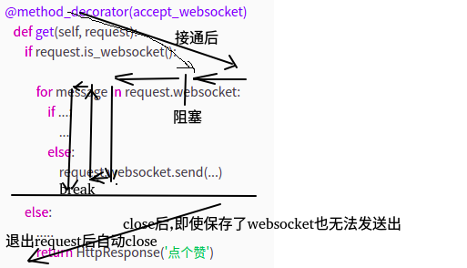

# django进阶02websocket
本文适合有一定websocket基础的，至少完整看过前后端demo的读者，一窍不通的小白建议先阅读“参考”部分的博文扫扫盲。

基于django的dwebsocket组件(目前虽然不在维护，但正常使用没问题）


## 前端方法

```
<script type="text/javascript">
    var socket = new WebSocket("ws:" + window.location.host + "/drug/drug_connect/");
    socket.onopen = function () {
        console.log('WebSocket open');//成功连接上Websocket
        socket.send('adasdasda。。。。');//发送数据到服务端
    };
    socket.onmessage = function (e) {
        console.log('message: ' + e.data);//打印服务端返回的数据
    };
    socket.onclose=function(e){
      console.log(e);
      socket.close(); //关闭TCP连接
    };
    if (socket.readyState == WebSocket.OPEN) socket.onopen();
</sctipt>

```
由于js的异步友好性，所以代码看起来非常清爽，也容易理解。socket连接，成功后干什么（onopen）,收到消息后干嘛（onmessage），如何关闭等。而且也会自动发送Pingpong包确保连接的保持。

## 后端方法

dwebsocket的一些内置方法：

request.is_websocket（）：判断请求是否是websocket方式，是返回true，否则返回false

request.websocket： 当请求为websocket的时候，会在request中增加一个websocket属性，

WebSocket.wait（） 返回客户端发送的一条消息，没有收到消息则会导致阻塞

WebSocket.read（） 和wait一样可以接受返回的消息，只是这种是非阻塞的，没有消息返回None

WebSocket.count_messages（）返回消息的数量

WebSocket.has_messages（）返回是否有新的消息过来

WebSocket.send（message）像客户端发送消息，message为byte类型


后端方法相对前端就没有那么友好了。如果面对一个特定需求如何实现呢？


## 场景1，1v0聊天

这个实际业务中没啥用，仅用来验证websocket接口性质，了解接口特性而已。

```
@accept_websocket
def start_server_script(request):
    if request.is_websocket():
        # "这里实现wbsocket连接逻辑"
        for info in request.websocket:# 这里需要注意的是，这个for后面的对象，request.websocket是阻塞的，也就是说如果对方发送消息,info=新消息，循环走一圈，如果对方不发消息，for这里会“卡住”，这里容易忽略
            request.websocket.send("你刚才对我说:%s"%info)
         print('这里其实不会被执行')
    else:
        # "这里实现http连接逻辑"
        pass
```


## 场景2，多v多聊天

上面的例子很简单吧，自己和自己聊天，多v多聊天代码和上面差不多!

将request.websocket看做普通对象，将所所有连接的websocket保存全局变量中，依次send(msg)即可.

```
wobsocket_map=dict()
@accept_websocket
def start_server_script(request):
    if request.is_websocket():
        wobsocket_map[id(request.websocket)]=request.websocket
        # "这里实现wbsocket连接逻辑"
        for info in request.websocket:# 这里需要注意的是，这个for后面的对象，request.websocket是阻塞的，也就是说如果对方发送消息,info=新消息，循环走一圈，如果对方不发消息，for这里会“卡住”，这里容易忽略
            [websocket.send("你刚才对我说:%s"%info) for websocket in wobsocket_map.values()]
         print('这里其实不会被执行')
    else:
        # "这里实现http连接逻辑"
        pass
```
可以实现效果，将msg发送给所有连接到此websocket的对象！


## 场景3，视频播放

视频播放是一种类似死循环的处理逻辑

```
# 伪代码，不保证能跑，意思差不多
# 其他函数通过next(),or .send()调用此生成器，不断生成各个视频帧的base64编码（看不懂的话，百度"yield"）
url='rtmp://xxxx'
@accept_websocket
def show_video(request):
    video=video_img_base64(url)
    base64=next(video)
    while base64 is not None: # 这个就是类似死循环的东西（当然这个并非真正死循环，但很多情况退出只能放到循环里break，这里只能采用while True）
        request.websocket.send({'img_base64':base64})
        base64=video.send(None)

def video_img_base64(url):
    cap=cv2.VideoCapture(url)
    ret,frame=cap.read()
    while ret:
        yield base64(frame.tobytes()).decode('utf8')
        ret,frame=cap.read()
    else:
        yield None　#调用方一旦收到None，避免调用next()　or send()否则抛出异常，需要做异常处理
```


## 场景4，视频播放及控制

相比前面的例子，多了控制逻辑，那么问题来了，控制逻辑放哪里？

如果后台也可以向js那样，onmessage(xxx),这样就简单多了，onmessage()，根据message修改一个类似全局变量的东西就行。但是并没有。

从场景１的例子可以看出，websocket非常擅长处理request-response的情况。例子3,看到其也可以处理 持续response推送的情况，那么如何实现类似异步里面交互式响应呢？

这里提供一个简单模板

```
send_queue=Queue()
@accept_websocket
def websocket_ctrl(request):
    if request.is_websocket:
        while True:# 由于使用同步方式处理异步，所以这里必然死循环
            if request.websocket.count_messages()>0:
                message=request.websocket.read()
                while message:
                    onmessage(message)
                    message=request.websocket.read()
           　if not send_queue.empty:# 需向send_queue放东西，send函数中会放message
           　    messsage=send_queue.pop()
           　    while message:
                    message=request.websocket.send(message)
                    messsage=send_queue.pop()

def onmessage(message):
    pass # 这里可以放你想在收到消息时做的事情,类似异步方法的onmessage，如果需要反馈修改，比如改变上一级的执行逻辑，则可以通过返回值的方式，传递给上一级调用者，让上一级调用者通过返回值调整自身执行逻辑

# 他人调用这个方法，将消息加入发送队列，在websocket_ctrl的循环中会取得，并发出
def send(message):
   send_queue.put(message)

```
注意：尽可能避免使用

```
for message in request.websocket:
    print(message)
```
由于其会导致阻塞，特别强调这一点，因为大多数情况，我们看到for循环，会想当然以为”它很快会结束“，其实未必。
还有一点就是需要加异常处理，对方可能主动关闭连接，此时后台如果发送消息，会抛出异常。


## 总结

流程图




|                方法                |                                         典型使用形态                                         | 阻塞 |                     开启连接                     |        (客户端)发送消息         |      (客户端)断开连接       |
| --------------------------------- | ----------------------------------------------------------------------------------------- | ---- | ---------------------------------------------- | ---------------------------- | ------------------------ |
| request.websocket                 | for msg in request.websocket:func(msg)                                                      | 是   | halt:request.websocket                          | msg<='common msg'             | msg<=None                |
| request.websocket.wait()           | while True: msg=request.websocket.wait()                                                    | 是   | halt:request.websocket.wait()                   | msg<='common msg'             | msg<=None                |
| request.websocket.read()           | while True:msg=request.websocket.read()                                                     | 否   | loop:msg<=request.websocket.read()               | msg<=request.websocket.read() | except                   |
| request.websocket.has_messages()   | while True:has\_msg=request.websocket.has\_messages();if has_msg:msg=request.websocket.read() | 否   | loop:has\_msg<=request.websocket.has\_messages() | msg<=request.websocket.read() | has_msg=True and msg=None |
| request.websocket.count_messages() | while True:count=request.websocket.count_messages();if count>0:msg=request.websocket.read()   | 否   | loop:count<=request.websocket.count_messages()   | msg<=request.websocket.read() | count>0 and msg=None      |

多重捕获会怎样？直观理解即可，只能有一个捕获到消息，不会重复捕获。


## 参考

https://www.520pf.cn/article/135.html

https://blog.csdn.net/xianailili/article/details/82180114

