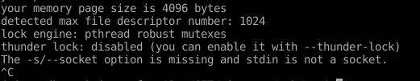
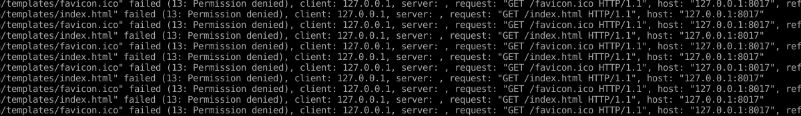
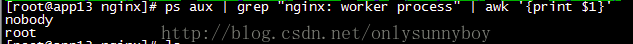
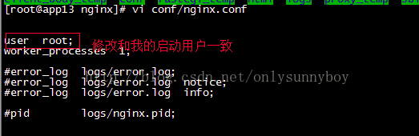

# django进阶04部署上线(nginx,uwsgi,supervisor)
## django自身服务ok

python manage.py runserver，验证可正常访问


## uwsgi安装和服务验证

安装:pip Install uwsgi

测试代码

```

def application(env, start_response):

    start_response('200 OK', [('Content-Type','text/html')])

    return [b"Hello World"]

```

执行下面命令行:

```
uwsgi --plugin python --http :8001 --wsgi-file test.py  
```
重新访问 localhost:8001

就可以看到 成功的显示了 'Hello world'


如果报错:error while loading shared libraries: libpcre.so.1: cannot open shared object file: No such file or directory

解决方式：

```

sudo apt-get install libpcre3 libpcre3-dev # 安装需要的包

find / -name libpcre.so.3 # 找到libpcre.so.3（一般在根目录/lib/x86_64-linux-gnu下）

找到 /lib/x86_64-linux-gnu/libpcre.so.3

sudo ln -s /lib/x86_64-linux-gnu/libpcre.so.3 /usr/lib/libpcre.so.1 # 做软链接即可

```


## uwsgi对接django配置ini

```

[uwsgi]

#使用nginx连接时使用

#socket=127.0.0.1:8080  #正式上线后使用此模式，速度稍有优势
#直接做web服务器使用

http=127.0.0.1:8080  #联调阶段优先使用http模式，方便定点测试
#项目目录

chdir=/home/shuan/dailiyfresh #这里可能需要多次尝试，如果报错can't find module **,大概率这里问题

#项目中wsgi.py文件的目录，相对于项目目录

wsgi-file=dailiyfresh/wsgi.py #这里尽可能使用绝对路径避免踩坑 
# 指定启动的工作进程数

processes=4

# 指定工作进程中的线程数

threads=2

master=True

# 保存启动之后主进程的pid

pidfile=uwsgi.pid

# 设置uwsgi后台运行，用uwsgi.log保存日志信息

daemonize=uwsgi.log

# 设置虚拟环境的路径

virtualenv=/home/shuan/.virtualenvs/bj18_py3# conda 环境路径

```


启动：uwsgi --ini uwsgi.ini

停止：uwsgi --stop uwsgi.pid


启动后访问8080查看是否启动成功。


## uwsgi对接supervisor

安装supervisor：pip install supervisor

生成初始配置文件：echo_supervisord_conf > /etc/supervisord.conf

```

[program:zqxt]

command=/usr/bin/uwsgi(视环境情况 which uwsgi,本例用pip安装应该是conda环境里的uwsgi地址) --ini uwsgi_conf.ini  #可终端单独执行此命令，确保正确
directory=/path/to/zqxt#同uwsgi_conf的chdir，项目目录

startsecs=0

stopwaitsecs=0

autostart=true #测试阶段改为false,让错误暴露出来

autorestart=true #测试阶段改为false,让错误暴露出来

```


修改:supervisor_conf

```
redirect_stderr = true  ; 把 stderr 重定向到 stdout，默认 false  
stdout_logfile_maxbytes = 20MB  ; stdout 日志文件大小，默认 50MB  
stdout_logfile = /data/log/plantool_stdout.log  
stderr_logfile = /data/log/plantool_err.log  
```

修改wsgi_conf.ini

```
#daemonize=/var/log/uwsgi8011.log   #  守护进程一定要注释掉(关键)  
```

功能测试

```
启用config配置：supervisord -c /etc/supervisord.conf  
supervisorctl status        //查看所有进程的状态
supervisorctl stop es       //停止es
supervisorctl start es      //启动es
supervisorctl restart es     //重启es
supervisorctl update        //配置文件修改后使用该命令加载新的配置
supervisorctl reload        //重新启动配置中的所有程序
```
启动只是启动conf配置，需要supervisorctl start 才是真正启动（也就是说，使用supervisorctl前必须先执行supervisord）


下面这一段描述问题在于supervisord当做开启服务的了，其实不是，supervisord之后使用supervisorctl才是真正开启服务.


再次启动，查看 supervisorctl status，状态为退出(exited)，可见出了问题，查看错误日志plantool_err.log



thunder lock：search ，没有效信息，所以这个可能是正常状态的日志。

猜--socket导致问题，搜索也没发现有效信息，可能也是对的。


## nginx对接uwsgi

先确保nginx安装成功

nginx安装后：http://localhost,如果显示nginx欢迎页，说明nginx默认配置ok


修改nginx配置(大概意思)

```

server {

    listen      80 ;

    charset     utf-8;


    client_max_body_size 75M;


    location /api {  # 后台api接口
        proxy_pass 127.0.0.1:8080;
    }

    location /media  {

        alias /path/to/project/media;

    }


    location /static {

        alias /path/to/project/static;

    }


    location / {  # html资源文件
        root /path/to/template;
        index index.html;
    }

}

```

先测试后端接口:127.0.0.1:8080/api/,ok

再测试转发接口:127.0.0.1:80/api/,是否正确转发.

最后再测试html,静态文件(static),媒体文件(media）等.


可能问题：报错nginx: [emerg] getgrnam("nginx") failed：https://blog.csdn.net/qq_39556759/article/details/78406813

解决方法：

vim /aplication/nginx/conf/nginx.conf

去掉user nobody之前的#号（也就是说启用user 的配置项）


可能问题：访问Html,css,js资源文件，报错，13: Permission denied

前端，templates/index.html，无权限




权限不足的解决方案:

一、由于启动用户和nginx工作用户不一致所致（user配置项配置错误）

01，查看nginx的启动用户，发现是nobody，而非root启动的

命令：ps aux | grep "nginx: worker process" | awk'{print $1}'



02，将nginx.config的user改为和启动用户一致，

命令：vi conf/nginx.conf




这一步，根据个人经验，**应该修改为"/html/or/templates/目录拥有者的用户"和组信息**，比如

当前为用户john(/templates/拥有者，负责启动nginx的人，是否有root权限无所谓),则通过"id john"查看所属组,比如 work组

则配置:"user john work"，**效果是启动后的nginx子进程显示的启动者是john**（而实际nginx启动者可能是别人，有root权限的其他人）

这一步可能需要多做尝试，本人这一步卡了好久，尝试了很多组合，最后才发现正确配置(主要是网上教程差异很大，拜版本不同所赐，踩坑颇多)

```
user www-data    #nginx -t 测试通过,启动后访问权限不足
user nobody     # nginx -t 测试不通过,
user john    # nginx -t 测试不通过,（john无root权限，无法启动nginx，但是templates目录拥有者）
user yyyy    # nginx -t 测试不通过,（yyyy有root权限，且是nginx服务启动者）
删除:user 这一行    # nginx -t 测试通过,启动后访问权限不足

user work john    # nginx -t 测试不通过,
user work yyyy    # nginx -t 测试不通过,
user john work    # nginx -t 测试通过,启动后访问ok
```


二、templates权限问题，**如果nginx没有web目录的操作权限，也会出现403错误**。

解决办法：修改web目录的读写权限，或者是把nginx的启动用户改成目录的所属用户，重启Nginx即可解决

```
chmod -R 777 /data  
chmod -R 777 /data/www/  
```

## 验证无问题后的进一步改进


01，nginx的转发（到uwsgi），从http转发模式改为socket转发模式（nginx.conf,uwsgi.conf）（对接阶段使用http，方便独立的正确性验证。正式环境改为socket模式，保证速度以及减少端口占用。）

02，supervisord.conf配置的autostart和autorestart改为true。确保进程死机后自动重启。

03，检查各路径配置，是否有私有路径（别人无法访问的路径）,可能导致别人无法启动项目。


## 其他注意事项

### 启用django后台管理admin模块

启用admin后会发现无法进入登录界面（部分资源无法加载static/admin/simple-ui/xxxx）

原因：问题admin/下的静态资源无法访问。

大部分项目前后端完全分离，所以templates和static一般都是前端组提供，我们想当然就用了，而实际上django_admin模块内部也包含部分静态资源，当使用django内置服务器时可以检索到，但如果部署到线上则必须将admin内静态文件导出，整合到统一的templates目录中(让nginx检索到)。
解决：
```
python manage collectstatic # 自动收集静态文件到django_setting配置的STATIC_ROOT中
cp STATIC_ROOT templates/static
chmod -R 777 xxx
```
## 参考

linux下部署Django uwsgi: error while loading shared libraries: libpcre.so.1: cannot open shared object file: No such file or directory:https://www.cnblogs.com/erhangboke/p/11673156.html

初次使用uwsgi:no python application found, check your startup logs for errors:https://www.cnblogs.com/loveyangaddddd/p/8119720.html

uWSGI出现错误：no python application found, check your startup logs for errors:https://blog.csdn.net/weixin_40576010/article/details/89000128

supervisor管理uwsgi：https://www.cnblogs.com/supery007/p/9368242.html

Django 部署(Nginx)：https://code.ziqiangxuetang.com/django/django-nginx-deploy.html

使用supervisor作为uWSGI的守护进程:luchanghong.lofter.com/post/f04c0_242345

Supervisor使用详解:https://www.jianshu.com/p/0b9054b33db3

解决Nginx出现403 forbidden (13: Permission denied)报错的四种方法：https://www.cnblogs.com/williamjie/p/9604594.html

nginx 错误集锦：https://www.jianshu.com/p/3de849802a89

Nginx之proxy_pass指令url反斜杠作用：https://blog.csdn.net/sleepIII/article/details/100787652  