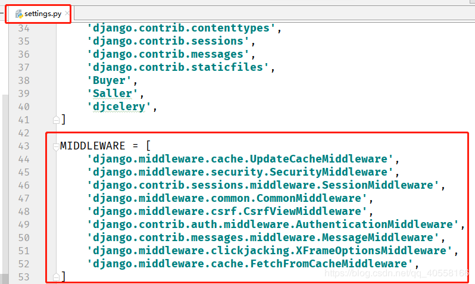
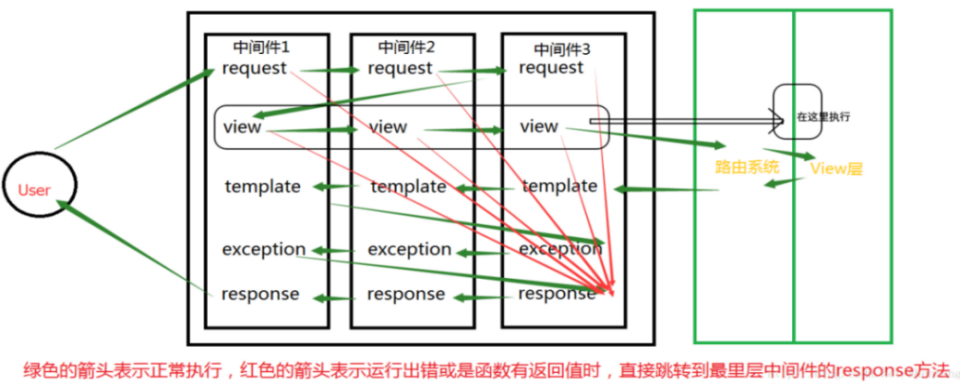
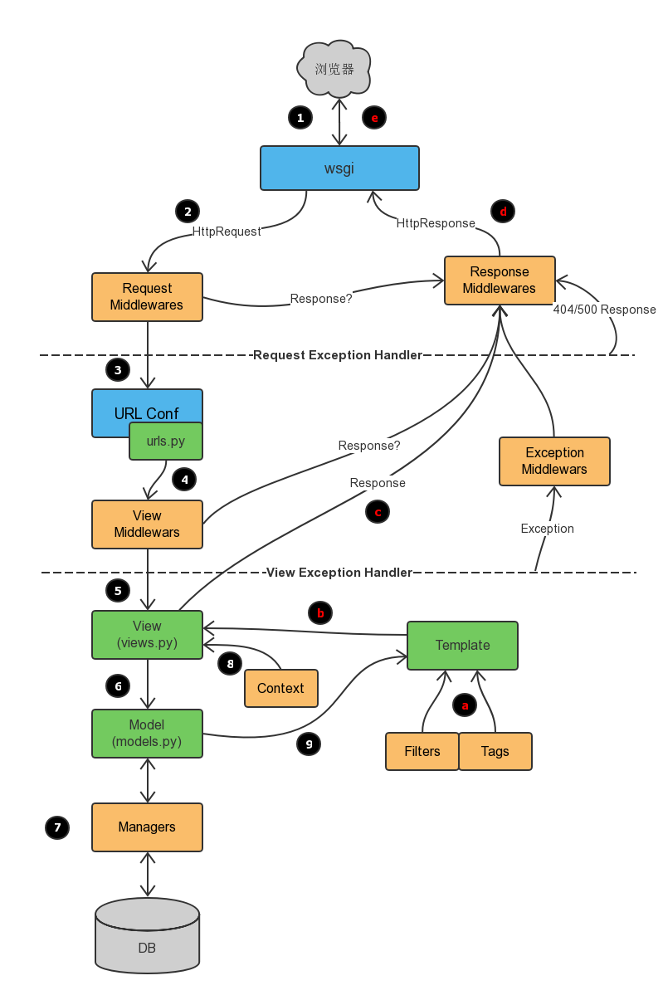

# django进阶05中间件
## 什么是中间件

django的中间件（middleware）是一个轻量级的插件系统，在django中的请求和响应中，可以利用中间件干预视图的请求和响应。

## 如何启用中间件

若要启用中间件组件，请将其添加到 Django 配置文件settings.py的 MIDDLEWARE 配置项列表中。





## 五大钩子函数


传统方式自定义中间件其实就是在编写五大钩子函数：

```
process_request(self,request)
process_response(self, request, response)
process_view(self, request, view_func, view_args, view_kwargs)
process_exception(self, request, exception)
process_template_response(self,request,response)
```
可以实现其中的任意一个或多个！


## 中间件的顺序问题

从上一部分可以看出，中间件是有多个的，既然有多个必然涉及到优先级或顺序问题，顺序大体上符合先来后到（不存在插队类型的优先级，要么正序，要么逆序，不能插队跳跃执行）

MIDDLEWARE 的顺序很重要，具有先后关系，因为有些中间件会依赖其他中间件。例如： AuthenticationMiddleware 需要在会话中间件中存储的经过身份验证的用户信息，因此它必须在 SessionMiddleware 后面运行 。

在请求阶段，调用视图之前，Django 按照定义的顺序执行中间件 MIDDLEWARE，自顶向下。

你可以把它想象成一个**洋葱：每个中间件类都是一个“皮层”**，它包裹起了洋葱的核心--实际业务视图。如果请求**通过了洋葱的所有中间件层，一直到内核的视图**，那么响应将在**返回的过程中以相反的顺序再通过每个中间件层**，最终返回给用户。

如果某个层的执行过程认为当前的请求应该被拒绝，或者发生了某些错误，导致**短路，直接返回了一个响应**，那么**剩下的中间件以及核心的视图函数都不会被执行**。




图上一部分标识错误了，已经标注出来(view的执行在路由后，view视图函数前)


更为详细的执行流




## 可以做什么

Cache:缓存中间件

如果启用了该中间件，Django会以CACHE_MIDDLEWARE_SECONDS 配置的参数进行全站级别的缓存。


Common:通用中间件

禁止DISALLOWED_USER_AGENTS中的用户代理访问服务器

自动为URL添加斜杠后缀和www前缀功能。如果配置项 APPEND_SLASH 为True ，并且访问的URL 没有斜杠后缀，在URLconf中没有匹配成功，将自动添加斜杠，然后再次匹配，如果匹配成功，就跳转到对应的url。 PREPEND_WWW 的功能类似。

为非流式响应设置Content-Length头部信息。


GZip:内容压缩中间件

用于减小响应体积，降低带宽压力，提高传输速度。

该中间件必须位于其它所有需要读写响应体内容的中间件之前。


Locale:本地化中间件

用于处理国际化和本地化，语言翻译。


Message:消息中间件

基于cookie或者会话的消息功能，比较常用。


Security:安全中间件


Site:站点框架。

这是一个很有用，但又被忽视的功能。

它可以让你的Django具备多站点支持的功能。

通过增加一个site属性，区分当前request请求访问的对应站点。

无需多个IP或域名，无需开启多个服务器，只需要一个site属性，就能搞定多站点服务。  `

Authentication:认证框架

Django最主要的中间件之一，提供用户认证服务。


CSRF protection:提供CSRF防御机制的中间件


X-Frame-Options:点击劫持防御中间件

## 可能遇到问题

**全局异常object() takes no parameters**

错误信息如下

```
#  File "C:\python\lib\site-packages\django\core\handlers\wsgi.py", line 151, in __init__
#     self.load_middleware()
#   File "C:\python\lib\site-packages\django\core\handlers\base.py", line 82, in load_middleware
#     mw_instance = middleware(handler)
# TypeError: object() takes no parameters
```

出错原始代码：

```
# from django.http import HttpResponse
# class MyException(object):
#     def process_exception(request,response, exception):
#         return HttpResponse(exception.message)
```

正确代码1:

```
# class MyException(object):
#     def __init__(self, get_response):
#         self.get_response = get_response
#
#     def __call__(self, request):
#         return self.get_response(request)
#
#     def process_exception(self, request, exception):
#         return HttpResponse(exception)
```
正确代码2

```
from django.http import HttpResponse
from django.utils.deprecation import MiddlewareMixin

class MyException(MiddlewareMixin):
    def process_exception(self, request, exception):
        return HttpResponse(exception)
```

**兼容 Django新版本和旧版本**
```
try:
    from django.utils.deprecation import MiddlewareMixin  # Django 1.10.x
except ImportError:
    MiddlewareMixin = object  # Django 1.4.x - Django 1.9.x
 
class SimpleMiddleware(MiddlewareMixin):
    def process_request(self, request):
        pass
 
    def process_response(request, response):
        pass
```

## 参考

Django(十二）：Django框架中的middleware中间件:https://blog.csdn.net/qq_40558166/article/details/102467833

Django框架全面讲解 -- 中间件（MiddleWare）:https://blog.csdn.net/shentong1/article/details/78829599

Django 中间件:https://www.runoob.com/django/django-middleware.html

Django之Middleware(中间件):https://www.cnblogs.com/Alexephor/p/11272839.html

Django中间件:https://www.liujiangblog.com/blog/45/

Django 中间件:https://code.ziqiangxuetang.com/django/django-middleware.html

Python Django，中间件，中间件函数，全局异常处理：https://blog.csdn.net/houyanhua1/article/details/85028983

django全局异常捕获保存和输出，logger配置:https://hhyo.github.io/2018/04/16/django-traceback/

django中间件修改，以及TypeError: object() takes no parameters的异常处理:https://my.oschina.net/u/4374968/blog/3899317  