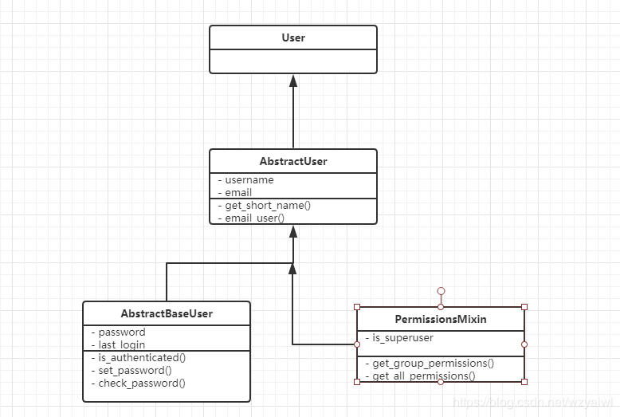
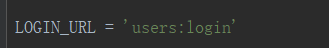
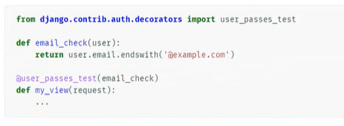
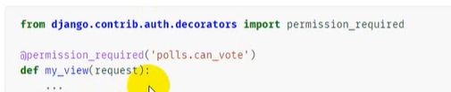

# django进阶07用户模块与权限系统
Django默认提供了用户权限管理模块auth

```
user表，User是auth模块中维护用户信息的表，在数据库中该表被命名为auth_user. 该表继承自Abstractuser.  
group表，定义用户组模型，该表只包含一个name字段和一个permissions(权限)多对多关系字段，在数据库中被命名为auth_group.  
Permission,  权限表，提供表级别的权限控制，可以检查用户是否对某个表拥有增（add），改(change)，删（delete）权限。  
```
从数据库生成的表来看，这三张表实现了两两多对多的关联，其中用户和组生成的第三张表是auth_user_groups,group和permission生成的第三张表是auth_group_permissions,用户和权限生成的第三张表是auth_user_user_permissions。这里我们主要介绍下user表。


## User表

在auth中user继承自AbstractUser，其中AbstractUser又继承自AbstractBaseUser和PermissionsMixin，其中AbstractBaseUser只保存了密码和登陆时间，PermissionsMixin提供了权限先关的字段，比如：is_superuser和组合权限表之间的关联。



User对象的字段

```
password：Django默认保存是加密后的密码，无法直接看到明文密码  
last_login：上一次登陆时间  
is_superuser：是否是超级管理员，是为1，否为0  
username：用户名  
first_name  
last_name  
email：邮箱  
is_staff：用户是否拥有网站的管理权限  
is_active：是否允许用户登录, 设置为 False，可以在不删除用户的前提下禁止用户登录。  
data_joined：账户创建日期  
groups： 与组多对多关联的字段  
user_permissions： 与权限关联的多对多字段，也就是是说明了为什么第三张表表为auth_user_user_permissions. 表名（user）+字段名（user_permissions）  
```
类属性

```
is_authenticated：判断是否被认证，即是否登陆  
is_anonymous： 是否为匿名用户  
username_validator：指向用于验证用户名的验证实例，默认是validators.UnicodeUsernameValidator  
```
类方法

```
get_username()：  获取用户名  
get_full_name()： 获取全名，即first_name+空格+last_name  
get_short_name()：获取first_name  
set_password(raw_password)： 设置密码,如果raw_password是None，则密码将被设置为不可用的密码，就像使用了 set_unusable_password() 一样。  
check_password(raw_password)： 检查密码是否正确。  
set_unusable_password()：将用户标记为未设置密码，即密码为None  
has_usable_password()：返回该用户是否未设置密码  
get_group_permissions()： 获取这个用户所在组中所具有的的全部权限。  
has_perm()： 判断一个用户是否具有某个权限。  
has_perms(perm_list)： 判断用户对一个权限列表是否具有权限。  
has_module_perms(package_name)： 判断对app是否有权限。  
```

## 常用方法

1.authenticate()：

提供了用户认证功能，即验证用户名以及密码是否正确，一般需要username 、password两个关键字参数。如果认证成功（用户名和密码正确有效），便会返回一个 User 对象。authenticate()会在该 User 对象上设置一个属性来标识后端已经认证了该用户，且该信息在后续的登录过程中是需要的，认证失败返回None。

user = auth.authenticate(username='theuser',password='thepassword')


2.login(HttpRequest, user):

该函数接受一个HttpRequest对象，以及一个经过认证的User对象。该函数实现一个用户登录的功能。它本质上会在后端为该用户生成相关session数据。

```
def my_view(request):  
    username = request.POST['username']  
    password = request.POST['password']  
    user = auth.authenticate(username=username, password=password)  
    if user is not None:  
        auth.login(request, user)  
        # Redirect to a success page.  
        ...  
    else:  
    # Return an 'invalid login' error message.  
        ...  
```
3.logout(request)：

该函数接受一个HttpRequest对象，无返回值。当调用该函数时，当前请求的session信息会全部清除。该用户即使没有登录，使用该函数也不会报错。

```
def logout_view(request):  
    auth.logout(request)  
    # Redirect to a success page.  
```
4.is_authenticated():

用来判断当前请求是否通过了认证。

```
def my_view(request):  
    if not request.user.is_authenticated():  
    return redirect('%s?next=%s' % (settings.LOGIN_URL, request.path))  
```
5.login_requierd()：

auth 给我们提供的一个装饰器工具，用来快捷的给某个视图函数添加登录校验。

```
from django.contrib.auth.decorators import login_required  
   
@login_required  
def my_view(request):  
    ...  
```
若用户没有登录，则会跳转到django默认的 登录URL '/accounts/login/ ' 并传递当前访问url的绝对路径 (登陆成功后，会重定向到该路径)。如果需要自定义登录的URL，则需要在settings.py文件中通过LOGIN_URL进行修改。 LOGIN_URL = '/login/' # 这里配置成你项目登录页面的路由


6.method_decorator()：

auth 给我们提供的一个装饰器工具，用来快捷的给某个类视图添加登录校验。

```
from django.contrib.auth.decorators import login_required  
from django.utils.decorators import method_decorator  
   
class Home(views.View):  
   
    @method_decorator(login_required)  
    def get(self, request):  
        return render(request, 'home.html')  
```
7.create_user()：

auth 提供的一个创建新用户的方法，需要提供必要参数（username、password）等。

```
from django.contrib.auth.models import User  
   
user = User.objects.create_user(username = '用户名', password = '密码', email = '邮箱', ...)  
check_password(password)  
```
8.create_superuser()：

auth 提供的一个创建新的超级用户的方法，需要提供必要参数（username、password）等。

```
from django.contrib.auth.models import User  
   
user = User.objects.create_superuser(username = '用户名', password = '密码', email = '邮箱', ...)  
check_password(password)  
```
9.permission_requires(权限,raise_exception=True)：

对视图函数指定权限验证。


## Group

django.contrib.auth.models.Group定义了用户组的模型， 每个用户组拥有id和name两个字段， 该模型在数据库被映射为auth_group数据表。

User对象中有一个名为groups的多对多字段， 多对多关系由auth_user_groups数据表维护。Group对象可以通过user_set反向查询用户组中的用户。

我们可以通过创建删除Group对象来添加或删除用户组:

```
# add  
group = Group.objects.create(name=group_name)  
group.save()  
# del  
group.delete()  
```
我们可以通过标准的多对多字段操作管理用户与用户组的关系:

```
#用户加入用户组  
user.groups.add(group)  
#或者  
group.user_set.add(user)  
  
#用户退出用户组  
user.groups.remove(group)  
#或者  
group.user_set.remove(user)  
  
#用户退出所有用户组  
user.groups.clear()  
  
#用户组中所有用户退出组  
group.user_set.clear()  
```

## Permission

Django的auth系统提供了模型级的权限控制， 即可以检查用户是否对某个数据表拥有增(add), 改(change), 删(delete)权限。

auth系统无法提供对象级的权限控制， 即检查用户是否对数据表中某条记录拥有增改删的权限。如果需要对象级权限控制可以使用django-guardian。

假设在博客系统中有一张article数据表管理博文， auth可以检查某个用户是否拥有对所有博文的管理权限， 但无法检查用户对某一篇博文是否拥有管理权限。

检查用户权限

```
user.has_perm方法用于检查用户是否拥有操作某个模型的权限:  
user.has_perm('blog.add_article')  
user.has_perm('blog.change_article')  
user.has_perm('blog.delete_article')  
```
上述语句检查用户是否拥有blog这个app中article模型的添加权限， 若拥有权限则返回True。

has_perm仅是进行权限检查, 即是用户没有权限它也不会阻止程序员执行相关操作。

```
@permission_required装饰器可以代替has_perm并在用户没有相应权限时重定向到登录页或者抛出异常。  
# permission_required(perm[, login_url=None, raise_exception=False])  
  
@permission_required('blog.add_article')  
def post_article(request):  
    pass  
```
每个模型默认拥有增(add), 改(change), 删(delete)权限。在django.contrib.auth.models.Permission模型中保存了项目中所有权限。

该模型在数据库中被保存为auth_permission数据表。每条权限拥有id ,name , content_type_id, codename四个字段。

管理用户权限

User和Permission通过多对多字段user.user_permissions关联，在数据库中由auth_user_user_permissions数据表维护。

```
#添加权限  
user.user_permissions.add(permission)  
  
#删除权限:   
user.user_permissions.delete(permission)  
  
#清空权限:   
user.user_permissions.clear()  
```
用户拥有他所在用户组的权限， 使用用户组管理权限是一个更方便的方法。Group中包含多对多字段permissions， 在数据库中由auth_group_permissions数据表维护。

```
#添加权限:   
group.permissions.add(permission)  
  
#删除权限:   
group.permissions.delete(permission)  
  
#清空权限:   
group.permissions.clear()  
```
自定义权限

在定义Model时可以使用Meta自定义权限：

```
class Discussion(models.Model):  
  ...  
  class Meta:  
      permissions = (  
          ("create_discussion", "Can create a discussion"),  
          ("reply_discussion", "Can reply discussion"),  
      )  
```
判断用户是否拥有自定义权限:

```
user.has_perm('blog.create_discussion')  
```
## 视图的用户权限

无法添加或更改某个模型的用户将无法在管理员中看到。

如果我们在谈论自定义创建的视图，那么您可以创建一些检查用户权限的内容，如果没有该权限，则返回404。权限与模型相关联，组可分配各种权限。

您可以向模型添加权限：

```
 ＃myproject / myapp / models.py   

 class MyModel（models.Model）：  
 class Meta：  
 permission =（  
（'permission_code'，'友好许可描述'），  
）  
```
然后你可以检查一个用户是否有这样的权限：

```
@user_passes_test（lambda u：u.has_perm（' myapp.permission_code'））  
 def some_view（request）：  
＃...   
```
使用权限，您可以使用管理界面轻松地添加或删除用户和组。


## 用法实例

### 简单的认证

**Login_required 装饰器**

判断是否登陆，没有就自动重定向某个地方

用法：（局限于装饰函数）（如果要装饰一个类，则不能，要使用method_decorator）

```
@login_required(login_url='users:login')
def index_fn(reuqest):
    return HttpResponse('大家都是大牛')
```
自动跳转到login页面

登陆后：

**method_decorator装饰器**

```
@method_decorator(login_required(login_url='users:login'),name='dispatch')
class Index(View):
    def get(self, request):
        return render(request, 'admin/index.html', context={'request': request})
```
用法基本一样也就是一个是类视图一个是函数视图。

但是是否每一个都需要添加呢？不符合优秀程序员的做法（手动滑稽）因为实在是太丑了。

### Minxin认证

**LoginRequired Mixin**

需要设定重定向的URL（有一点restful的风格）

```
class Index(LoginRequiredMixin,View):
    login_url = 'users:login'
    def get(self, request):
        return render(request, 'admin/index.html', context={'request': request})
```
聪明的看得出来了，是否每一次都添加login_url呢，这里显然不是的，可以将login_url设置在Settings里面，我的Mixin会自动去settings里面寻找LOGIN_URL的参数。



```
?next=/admin/        可以自定义next   
@login_required(redirect_field_name='my_redirect_field')     这样就可以代替next
```
自动帮我们添加一个查询的参数在URL上面。

**user_passes_test**

这个比较通用于函数视图

以下为官方文档。 描述为判断登陆的用户的邮箱以‘@example.com’结尾，就为True，允许访问，如果相反，那么就禁止访问。可自定义




**userPassesTestMixin**

这个通用于类视图。

```
class Index(UserPassesTestMixin,View):
    def test_func(self):
        return self.request.user.username.endswith('son')

    def get(self, request):
        return render(request, 'admin/index.html', context={'request': request})
```
test_func为Mixin所定的。测试是否通过，为TRUE则可以进入，FALSE为相反。

### 权限

**permission_required decorator**

首先这里要注意权限和认证的区别，认证给你登陆了，但不一定给你看某些好看的东西。除非微信转钱。

permission_required(perm.login_url=None,raise_exception=False)

perm为权限多个权限就可以用一个列表或者元组都行。放在函数视图里面。



 perm 第一部分模型名字    第二部分为codename

**permissionRequiredMixin mixin**

使用于类视图里面。

```
lass TagManage(PermissionRequiredMixin,View):
    """
    create tags manage view
    route: admin/tags/int
    """
    permission_required = ('news.add_tag', 'news.view_tag')
    raise_exception = True # 403
    def get(self, request):
```
没有权限直接403


## 参考

Django权限系统auth模块详解：https://www.cnblogs.com/ccorz/p/6358074.html

Django2.0——权限系统Auth:https://blog.csdn.net/wzyaiwl/article/details/88597166

Django - 某些视图的用户权限？(Django - user permissions to certain views?)：https://www.it1352.com/635496.html

django 权限功能(根据不同的用户，设置不同的显示和访问权限):https://www.cnblogs.com/jackson669/p/12787676.html  