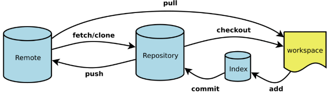
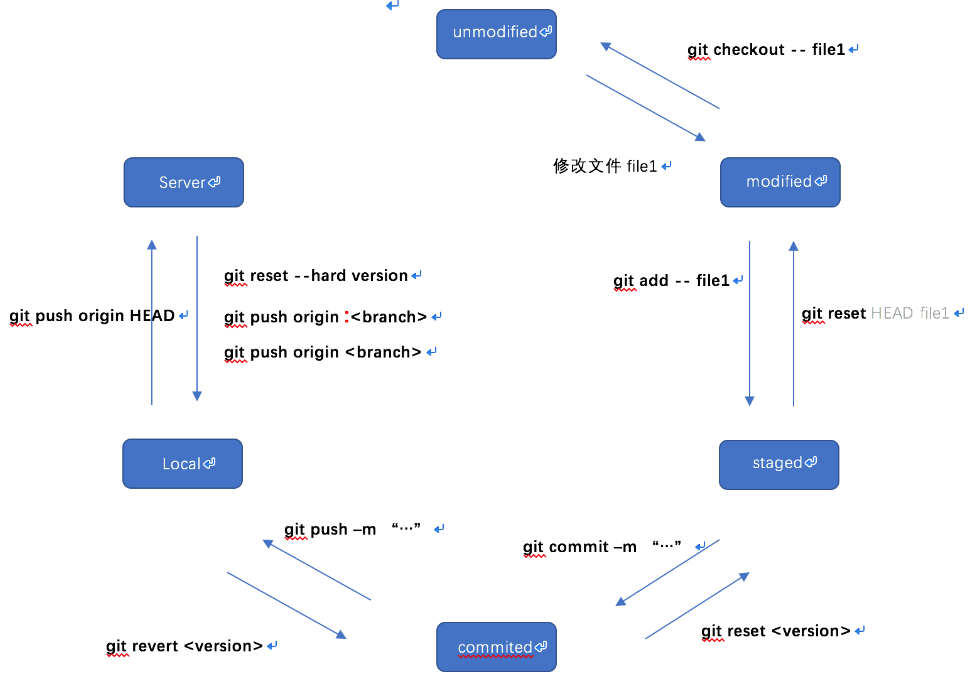

# 快捷手册03git
快捷手册_git

Workspace：工作区

Index / Stage：暂存区

Repository：仓库区（或本地仓库）

Remote：远程仓库

## 常用命令

|                                                           命令                                                            |                                说明                                |
| ----------------------------------------------------------------------------------- | ----------------------------------------------- |
| git pull origin master                                                                                           | 下载代码及快速合并                                   |
| git push origin master                                                                                         | 上传代码及快速合并                                   |
| git checkout master                                                                                             | 切换到master分支                                      |
| git checkout -b dev                                                                                              | 创建并切换到dev分支                                |
| git commit -m "first version"                                                                            | 提交                                                               |
| git remote add origin git@github.com:yeszao/dofiler.git                       | 配置远程git版本库                                      |
| git branch                                                                                                           | 显示所有分支                                               |
| git status                                                                                                                  | 查看状态                                                       |
| git log                                                                                                                       | 查看提交历史                                               |
| git clean -xdf                                                                                                      | 清理git(未commit，缓冲区的全部清理) |
| git rm -r --cached . && git add . && git commit -m 'update .gitignore'  | gitignore修改后不生效                              |
| git reset --hard origin/master                                                                        | 本地reset到remote相同版本                    |

## 基础配置
|                                                命令                                                 |                                 说明                                  |
| --------------------------------------------------------------------- | ------------------------------------------------- |
| git config --global core.editor vim                                             | 设置默认编辑器为vim（git默认用nano） |
| git config --global user.name "YOUR NAME"                           | 设置用户名                                                      |
| git config --global user.email "YOUR EMAIL ADDRESS"      | 设置邮箱                                                          |

## 创建版本库 
|             命令             |             说明             |
| --------------------- | --------------------- |
| $ git clone < url >    | 克隆远程版本库     |
| $ git init                   | 初始化本地版本库 |

## 修改和提交
|             命令             |                 说明                 |
| --------------------- | --------------------------- |
| git status                 | 查看状态                         |
| git diff                      | 查看变更内容                 |
| git add .                   | 跟踪所有改动过的文件 |
| git add < file >          | 跟踪指定的文件             |

## 查看提交历史
|            命令            |                             说明                             |
| -------------------- | ------------------------------------------- |
| git log                    | 查看提交历史                                         |
| git log -p < file >   | 查看指定文件的提交历史                     |
| git blame < file >  | 以列表方式查看指定文件的提交历史 |

## 撤消 
|                    命令                     |                                   说明                                   |
| ------------------------------- | --------------------------------------------------- |
| git reset --hard HEAD          | 撤消工作目录中所有未提交文件的修改内容 |
| git reset --hard < version >  | 撤销到某个特定版本                                         |
| git checkout HEAD < file >   | 撤消指定的未提交文件的修改内容                 |
| git checkout -- < file >           | 同上一个命令                                                     |

## 分支与标签 
|                     命令                      |                 说明                 |
| --------------------------------- | --------------------------- |
| git branch                                 | 显示所有本地分支         |
| git checkout < branch/tag > | 切换到指定分支或标签 |
| git branch < new-branch >    | 创建新分支                     |
| git branch -D < branch >        | 删除本地分支                 |
| git tag                                        | 列出所有本地标签         |
| git tag <  tagname / >               | 基于最新提交创建标签 |

## 合并与衍合
|                       命令                        |                         说明                         |
| ------------------------------------ | ------------------------------------- |
| git merge < branch >                   | 合并指定分支到当前分支             |
| git merge --abort(--continue) | 取消当前合并，重建合并前状态 |
| git rebase < branch >                  | 衍合指定分支到当前分支             |

## 远程操作 
|                                 命令                                  |                 说明                 |
| ------------------------------------------------ | --------------------------- |
| git remote -v                                                     | 查看远程版本库信息     |
| git remote add  <  remote  > <  url  >              | 添加远程版本库             |
| git remote remove < remote >                      | 删除指定的远程版本库 |
| git pull < remote > < branch >                         | 下载代码及快速合并     |
| git push < remote > < branch >                       | 上传代码及快速合并     |
| git push < remote > :< branch/tag-name > | 删除远程分支或标签     |
| git push --tags                                                  | 上传所有标签                 |

## 参考
Git 常用命令大全：https://blog.csdn.net/halaoda/article/details/78661334

一张图记住所有Git常用命令：https://blog.csdn.net/dangyalingengjia/article/details/78299517

常用 Git 命令清单：www.ruanyifeng.com/blog/2015/12/git-cheat-sheet.html

Git 常用命令速查表：https://www.w3cschool.cn/git/git-cheat-sheet.html

