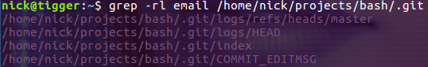
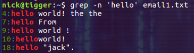
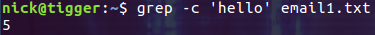

# 快捷手册06linux三剑客之grep
快捷手册grep

## 基本格式
grep 命令的基本格式如下：grep [选项] 模式 文件名

这里的模式，要么是字符（串），要么是正则表达式。


常用参数组合:

```
grep -rnw --include='*.txt' 'search content' /path_to_search/  
```
grep 命令常用选项及含义

| 选项 |                                                       含义                                                       |
| ----- | ----------------------------------------------------------------------------- |
| -c      | 仅列出文件中包含模式的行数。                                                             |
| -i       | 忽略模式中的字母大小写。                                                                     |
| -l       | 列出带有匹配行的文件名。                                                                     |
| -n      | 在每一行的最前面列出行号。                                                                 |
| -v      | 列出没有匹配模式的行。                                                                         |
| -w     | 把表达式当做一个完整的单字符来搜寻，忽略那些部分匹配的行。 |

注意，如果是搜索多个文件，grep 命令的搜索结果只显示文件中发现匹配模式的文件名；而如果搜索单个文件，grep 命令的结果将显示每一个包含匹配模式的行。

## 案例
【例 1】假设有一份 emp.data 员工清单，现在要搜索此文件，找出职位为 CLERK 的所有员工，则执行命令如下：

[root@localhost ~]# grep CLERK emp.data


而在此基础上，如果只想知道职位为 CLERK 的员工的人数，可以使用“-c”选项，执行命令如下：

[root@localhost ~]# grep -c CLERK emp.data


【例 2】搜索 emp.data 文件，使用正则表达式找出以 78 开头的数据行，执行命令如下：

[root@localhost ~]# grep ^78 emp.data


从根目录开始查找所有扩展名为 .log 的文本文件，并找出包含 "ERROR" 的行：

```
$ find / -type f -name "*.log" | xargs grep "ERROR"  
```
例子：从当前目录开始查找所有扩展名为 .in 的文本文件，并找出包含 "thermcontact" 的行：

```
find . -name "*.in" | xargs grep "thermcontact"  
```
一般情况下使用下面的命令(-n 显示行号，-w 表示匹配全词)：

$ grep -rnw 'path' -e 'pattern'


在递归的过程中只输出匹配内容所在的文件名称

如果我们只想查看匹配到的内容所在文件的名称，可以同时使用 r 和 -l, --files-with-matches 选项：

$ grep -rl email /home/nick/projects/bash/.git




在输出中显示行号

使用选 -n 可以在输出中显示行号：




统计匹配到的行的数量

使用选项 -c 可以统计匹配到的行的数量：




## 参考
Linux grep命令详解：查找文件内容:c.biancheng.net/view/4017.html

Linux grep 命令:https://www.runoob.com/linux/linux-comm-grep.html

Linux中grep命令详解:https://blog.csdn.net/qq_40797605/article/details/89075918

Linux grep 命令:https://www.cnblogs.com/sparkdev/p/11294517.html  