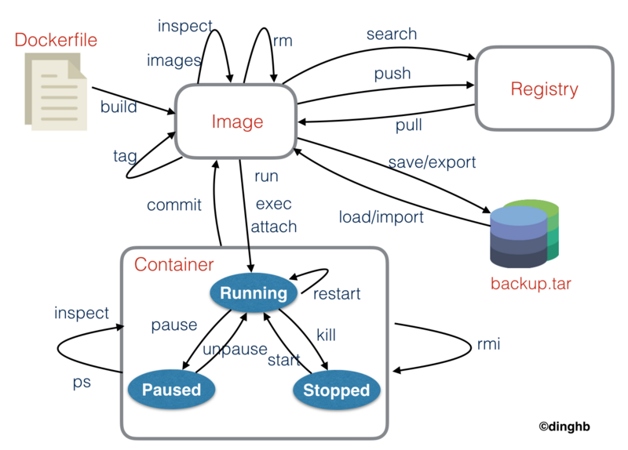

# 快捷手册04docker
docker基础知识速览，常用命令和操作。

## 命令关系图



由于docker的操作对象有点多，所以很容易搞混，其实大多数命令都是针对contrainer的.

针对image:images,image,search,pull,rmi,run,exec,save,load

针对contrainer:ps,start/stop/kill/rm/restart,inspect,top,logs,diff,cp,history,commit


## 查看docker信息（version、info）

|     操作or命令     |                 含义                  |
| ------------------ | --------------------------- |
| docker version | 查看docker版本             |
| docker info        | 显示docker系统的信息 |

## 启动停止服务


|           操作or命令           |     含义     |
| --------------------------- | ----------- |
| service docker start     | 服务开     |
| service docker stop     | 服务关     |
| service docker restart | 服务重启 |
有的是systemctl

## 对image的操作（images、search、pull、rmi）


|                 操作or命令                 |                    含义                    |
| ----------------------------------- | ------------------------------- |
| docker images　                       |     列出镜像列表                    |
| docker image ls　                     | 列出镜像列表                       |
| docker search image_name  |  检索image                           |
| docker pull image_name       |    下载image                         |
| docker rmi image_name        |        删除一个或者多个镜像 |

## 保存和加载镜像（save、load）
当需要把一台机器上的镜像迁移到另一台机器的时候，需要保存镜像与加载镜像。


| 操作or命令                                                              |  含义                                                      |
| ------------------------------------------------------ | ----------------------------------------- |
| docker save image\_name -o file\_path          |  保存镜像到一个tar包                         |
| docker load -i file_path                                         |  加载一个tar包格式的镜像;                |
| docker save image_name > /home/save.tar  | 01,机器a                                               |
| docker load < /home/save.tar                             |  02,使用scp将save.tar拷到机器b上 |

## 启动容器（run）

|                               操作or命令                                |                                     含义                                      |
| ------------------------------------------------------ | ------------------------------------------------------ |
| docker run image_name echo "hello word"  |  在容器中运行"echo"命令，输出"hello word" |
| docker run -it image_name /bin/bash             |  交互式进入容器中                                                 |
| docker exec -it \[容器ID\] /bin/bash                  | 再一次进刚才进入的容器                                      |
| docker run -d -it image_name                            |  启动容器以后台方式运行(更通用的方式）        |

## 对容器的操作（ps、rm、stop、start、kill、logs、diff、top、cp、restart、attach)


|                                               操作or命令                                               |                                                                                         含义                                                                                         |
| --------------------------------------------------------------------------- | --------------------------------------------------------------------------------------------------------------------------- |
| docker ps                                                                                                     | 列出当前所有正在运行的container                                                                                                                           |
| docker ps -a                                                                                                | 列出所有的container                                                                                                                                                   |
| docker ps -l                                                                                                 | 列出最近一次启动的container                                                                                                                                   |
| docker stop/kill/rm/restart Name/ID                                                 | 停止/杀掉/删除 单个容器                                                                                                                                             |
| docker stop/kill/rm/restart \`docker ps -a -q\`                             | 停止/杀掉/删除 所有容器                                                                                                                                             |
| docker stop/kill/rm/restart $(docker ps -f "status=exited" -q)  | 停止/杀掉/删除 所有退出的容器                                                                                                                                 |
| docker start/stop/kill/rm/restart Name/ID                                      | 启动、停止、杀死,重启一个容器                                                                                                                                |
| docker inspect Name/ID                                                                         | 查看container的具体信息                                                                                                                                           |
| docker top Name/ID                                                                                |  显示一个运行的容器里面的进程信息                                                                                                                        |
| docker logs Name/ID                                                                               | 从一个容器中取日志                                                                                                                                                     |
| docker logs -f Name/ID`                                                                         | 实时查看日志输出(类似 tail -f) (带上时间戳-t）                                                                                                       |
| docker diff Name/ID                                                                                 | 列出一个容器里面被改变的文件或者目录，list列表会显示出三种事件，A 增加的，D 删除的，C 被改变的 |
| docker cp ID:/container\_path to\_path                                           | 从容器里面拷贝文件/目录到本地一个路径                                                                                                               |
| docker history image_name                                                                 | 显示一个镜像的历史                                                                                                                                                     |

## 保存对容器的修改（commit）
保存对容器的修改
```
-a, --author="" Author; -m, --message="" Commit message 
docker commit ID new_image_name
```
## dockerfile
```
docker build -t [name 镜像名称] -f [路径 | 默认PATH/Dockerfile] . # 创建本地镜像  
```

## volumes 相关

|       操作or命令       |               含义               |
| --------------------- | ------------------------ |
| docker volume ls | 显示所有的volumes |
| docker volume prune | 删除无用的volume以释放存储空间 |

## 参考
docker常用命令整理：https://zhuanlan.zhihu.com/p/54946336

Docker常用命令整理并介绍：https://www.west.cn/docs/50045.html

Docker常用命令整理并介绍：https://www.west.cn/docs/50045.html

