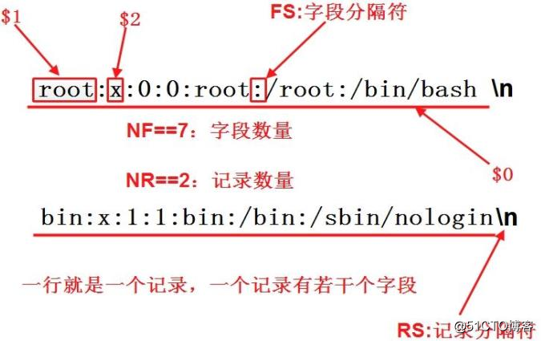

# 快捷手册07linux三剑客之awk
快捷手册awk

## 命令模版
awk '条件1 {动作 1} 条件 2 {动作 2} …' 文件名

举例：awk -F ':' '{ print $1 }' demo.txt




## 条件类型

|   条件类型    |  条 件   |                                                                             说 明                                                                              |
| -------------- | -------- | ------------------------------------------------------------------------------------------------------------ |
| awk保留字  | BEGIN | 在 awk 程序一开始，尚未读取任何数据之前执行。BEGIN 后的动作只在程序开始时执行一次 |
| awk保留字  | END     | 在 awk 程序处理完所有数据，即将结束时执行?END 后的动作只在程序结束时执行一次           |
| 关系运算符 | >           | 大于                                                                                                                                                           |
| 关系运算符 | <           | 小于                                                                                                                                                           |
| 关系运算符 | >=         | 大于等于                                                                                                                                                   |
| 关系运算符 | <=         | 小于等于                                                                                                                                                   |
| 关系运算符 | ==         | 等于。用于判断两个值是否相等。如果是给变童赋值，则使用"=”                                                 |
| 关系运算符 | !=         | 不等于                                                                                                                                                       |
| 关系运算符 | A~B      | 判断字符串 A 中是否包含能匹配 B 表达式的子字符串                                                                       |
| 关系运算符 | A!~B    | 判断字符串 A 中是否不包含能匹配 B 表达式的子字符串                                                                   |
| 正则表达式 | /正则/ | 如果在“//”中可以写入字符，则也可以支持正则表达式                                                                    |
| 逻辑运算符  | &&　    | 逻辑与                                                                                                                                                       |
| 逻辑运算符 | \|\|        | 逻辑或                                                                                                                                                       |

## 变量

|      参数       |                                                                含义                                                                |
| ------------- | ----------------------------------------------------------------------------------------- |
| NF                | 当前行有多少个字段，因此$NF代表最后一个字段。 $(NF-1)倒数第二个字段 |
| NR               | 当前处理的是第几行。举例:awk -F ':' '{print NR ") " $1}' demo.txt                    |
| FILENAME | 当前文件名                                                                                                                   |
| FS                | 字段分隔符，默认是空格和制表符。                                                                               |
| RS                | 行分隔符，用于分割每一行，默认是换行符。                                                       |
| OFS             | 输出字段的分隔符，用于打印时分隔字段，默认为空格。                                   |
| ORS             | 输出记录的分隔符，用于打印时分隔记录，默认为换行符。                               |
| OFMT          | 数字输出的格式，默认为％.6g。                                                                             |

## 函数

举例:awk -F ':' '{ print toupper($1) }' demo.txt


|      参数      |             含义             |
| ------------ | --------------------- |
| tolower()  | 字符转为小写。     |
| length()     | 返回字符串长度。 |
| substr()     | 返回子字符串。     |
| sin()           | 正弦。                     |
| cos()           | 余弦。                     |
| sqrt()         | 平方根。                 |
| rand()        | 随机数。                 |
## 条件
awk允许指定输出条件，只输出符合条件的行。

```
awk -F ':' '/usr/ {print $1}' demo.txt  # print命令前面是一个正则表达式，只输出包含usr的行。  
awk -F ':' 'NR % 2 == 1 {print $1}' demo.txt # 输出奇数行
awk -F ':' 'NR >3 {print $1}' demo.txt # 输出第三行以后的行
 awk -F ':' '$1 == "root" || $1 == "bin" {print $1}' demo.txt # 输出第一个字段等于指定值的行。
```

## if 语句
```
awk -F ':' '{if ($1 > "m") print $1}' demo.txt # 输出第一个字段的第一个字符大于m的行。
awk -F ':' '{if ($1 > "m") print $1; else print "---"}' demo.txt # if else 结构
```

## 参考
Linux awk用法：https://blog.51cto.com/13438667/2096206

Linux awk用法：https://blog.51cto.com/13438667/2096206：c.biancheng.net/view/992.html

awk 入门教程：www.ruanyifeng.com/blog/2018/11/awk.html

Linux awk 命令:https://www.runoob.com/linux/linux-comm-awk.html

